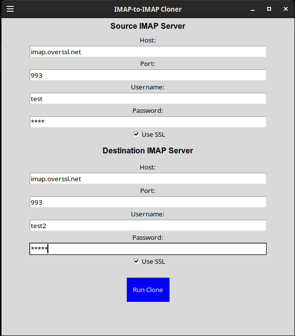

# imap-eml-python

This project provides tools to clone email from one IMAP server to another using Python. It includes a command-line script (`imapclone.py`) and an optional graphical user interface (`imapclone-gui.py`).

---

## 📨 imapclone.py

`imapclone.py` is a Python script that connects to a source IMAP account and clones all folders and emails to a destination IMAP account.

### 🔧 Features

- Clones **all folders** and **emails** (both read and unread)
- Replicates folder structure
- Supports **SSL** and non-SSL connections
- Command-line interface with sensible defaults
- Shows progress using `tqdm`

---

### 🐍 Usage

```bash
python3 imapclone.py -h
```

```
usage: imapclone.py [-h] -s HOST [-P PORT] -u USERNAME -p PASSWORD [--ssl]
                    [-rs REMOTE_HOST] -ru REMOTE_USERNAME -rp REMOTE_PASSWORD
                    [-rP REMOTE_PORT] [--rssl]

Dump IMAP account onto external server

options:
  -h, --help           show this help message and exit
  -s HOST              IMAP host
  -P PORT              IMAP port (default: 143)
  -u USERNAME          IMAP username
  -p PASSWORD          IMAP password
  --ssl                Connect using SSL

  -rs REMOTE_HOST      Remote IMAP host
  -ru REMOTE_USERNAME  Remote IMAP username
  -rp REMOTE_PASSWORD  Remote IMAP password
  -rP REMOTE_PORT      Remote IMAP port (default: 143)
  --rssl               Connect using SSL on remote server
```

---

## 🖥️ GUI Launcher (Optional)

A simple cross-platform GUI built with Tkinter is provided to make launching `imapclone.py` easier.

### ▶️ How to Use

```bash
python3 imapclone-gui.py
```

Fill in your source and destination IMAP connection details, then click **Run Clone** to launch the sync process in the background.

### 💡 GUI Features

- No need to use command-line arguments
- Easy toggles for SSL
- Runs `imapclone.py` with your inputs

---

### 🖼️ Screenshot

Below is a screenshot of the GUI:



---

## 📦 Requirements

- Python 3.6+
- `tqdm`:
  ```bash
  pip install tqdm
  ```

Tkinter is included with most Python installations by default.

---

## 📁 Project Layout

```
imap-eml-python/
├── imapclone.py              # Main script for cloning IMAP servers
├── imap_gui_launcher.py      # GUI launcher (Tkinter)
├── image.png                 # GUI screenshot
└── README.md
```

---

## ⚠️ Disclaimer

Use this tool at your own risk. It modifies mailboxes on both servers and is intended for legitimate backup and migration use only. Make sure you have the proper permissions and credentials for both servers.

---

## 🙌 Contributions

Feel free to open issues or pull requests to contribute improvements or bug fixes.
